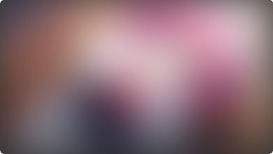

(TODO)


# Main Image

- as shown in demo, image can be clicked on to zoom
- image display automatically adjusts for any aspect ratio
- recommended aspect ratios are 16:9 to 1:1
- TODO example images for various aspect ratios, including edge cases

- possible to put text in `Picture` field
- TODO screenshot


## Automatically Add Images Using Tags

{{ feature_version("0.11.0.0") }}

One can automatically add a specific image if a card contains
a specific tag.
This is particularily useful for linear novels.
One can save an image of the cover, and add
the appropriate tag to all of the cards
to automatically set the image to the cover of the book.

This is specified under the [runtime options file](runtimeoptions.md){:target="_blank"}:

> `modules` →  `img-utils` →  `add-image-if-contains-tags`

Example:

```
"add-image-if-contains-tags": [
  {
    "tags": ["青春ブタ野郎・LN1"],
    "file-name": "_青春ブタ野郎-LN1.png"
  }
],
```

TODO example gif


# Collapsed Images

Any customly inserted images, including images inserted directly by Yomichan,
will be converted to text which you have to hover over to reveal.
Of course, this image can also be clicked on to zoom.
See the video demo below to see exactly what happens.


## How to Disable Collapsed Images
This image conversion can be globally disabled
in the [runtime options file](runtimeoptions.md){:target="_blank"}:

```json
"img-utils": {
  "stylize-images-in-glossary": false,
  // ...
}
```
Additionally, if you want to only disable this for some particular images,
[edit the HTML](faq.md#how-do-i-edit-the-fields-raw-html){:target="_blank"}
of the desired field, and add `data-do-not-convert="true"`.

An example is shown below:
```

```

# The `PrimaryDefinitionPicture` Field
{{ feature_version("0.11.0.0") }}

(TODO)

- shows image in the Primary Definition section
- main utility: it is not automatically collapsed
    - use this field when adding images related to the definition
    - i.e. when you would like to add an image for physical objects like "frog" or "chair"

(TODO image)

## Positioning
- by default, is shown below text
- if there is too much text, automatically adjusts itself to be shown to the right (like wikipedia)
- can force to be placed in one direction: `img-right` and `img-bottom`

(TODO images)


# Image Blur
{{ feature_version("0.10.3.0") }}

Images on cards can be automatically blurred by marked with a NSFW tag.
To mark a card as NSFW, add any of the following tags to the card:

> `nsfw`・`NSFW`・`-NSFW`

This behavior is **disabled by default**. In other words, you will not be able to blur
images unless the following setting is explicitly enabled
in the [runtime options file](runtimeoptions.md){:target="_blank"}:

??? examplecode "Enabling image blur *(click here)*"
    ```json
    "img-utils": {
      "enabled": true, // (1)!
      "nsfw-toggle": {
        "enabled": true,
        // ...
      }
    }
    ```

    1.  The `img-utils` module must be enabled to use the image blur feature.

<figure markdown>
  {{ img("example toggle blur gif", "assets/anki_blur/example.gif") }}
</figure>


!!! note
    Recall that you can use custom text in the `Picture` field instead of having an actual picture.
    This is useful if you simply don't want to save a particular image.


## Change Review Session State
The above demo shows how you can un-blur an image temporarily.
This means that if you see that card again during the same review session,
the image will be blurred again.

This state can be changed for a review session.
To toggle between review-session states, hover over the info circle,
and click on the eyeball to the top left.
This state will be maintained for the entire review session, but will be lost on the next session.

The tabs below show the available states.
By default, states cycle from left to right.


=== "Only Blur if NSFW"

    | Not Marked | Marked (with `NSFW` tag) |
    |:-:|:-:|
    | {{ img("", "assets/anki_blur/unmarked_revealed.png") }} |  |

=== "Always Blurred"

    | Not Marked | Marked (with `NSFW` tag) |
    |:-:|:-:|
    |  |  |

=== "Always Revealed"

    | Not Marked | Marked (with `NSFW` tag) |
    |:-:|:-:|
    | {{ img("", "assets/anki_blur/unmarked_revealed.png") }} | {{ img("", "assets/anki_blur/marked_revealed.png") }} |


??? example "Demos *(click here)*"

    === "Regular, unmarked card"
        {{ img("", "assets/anki_blur/example_session_toggle_unmarked.gif") }}

    === "Card marked as NSFW"
        {{ img("", "assets/anki_blur/example_session_toggle_marked.gif") }}

    !!! note
        Both examples have the info circle toggled (clicked), so the tooltip persists.


## Additional Details

- The eyeball to toggle the blur between an image will not be shown unless the card is marked as NSFW
    (or the review session state is "Always Blurred").
- Clicking on the blurred image will do nothing; you must click on the eye to un-blur the image.
    Forcing the user to click in a smaller area makes accidental reveals less common.
- After revealing the image, you can click on the image to zoom, as normal.
    You cannot click on a blurred image to zoom.
- Most things can be changed in the runtime options,
    including what tags can be used, the default initial state on PC/mobile, etc.
- This was heavily inspired by
    [Marv's implementation](https://github.com/MarvNC/JP-Resources#anki-card-blur)
    of the same feature.


