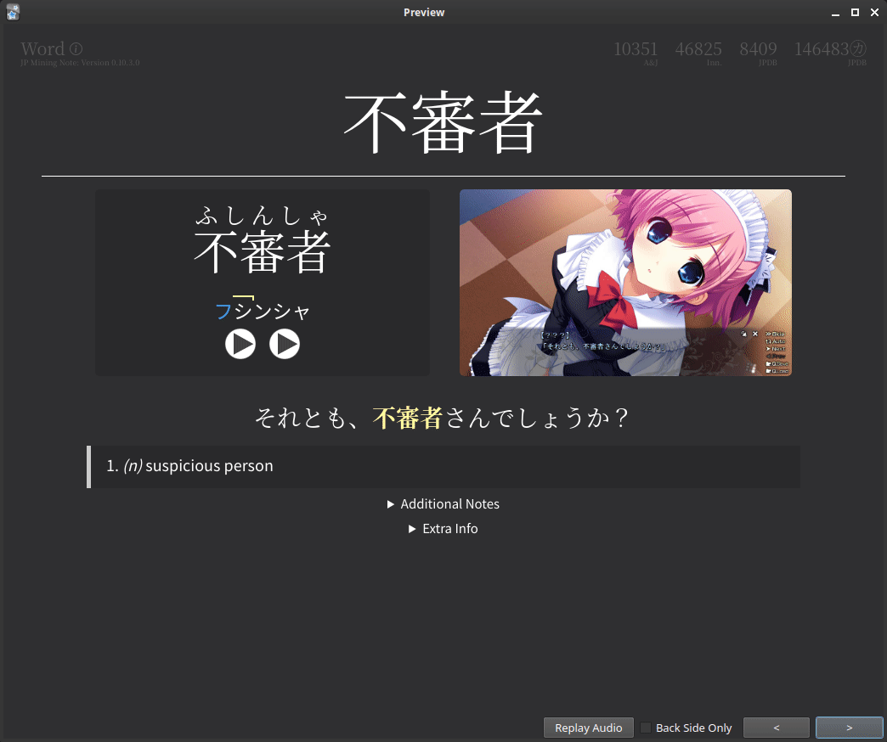

# Welcome to MkDocs

For full documentation visit [mkdocs.org](https://www.mkdocs.org).

## Commands

* `mkdocs new [dir-name]` - Create a new project.
* `mkdocs serve` - Start the live-reloading docs server.
* `mkdocs build` - Build the documentation site.
* `mkdocs -h` - Print help message and exit.

## Project layout

    mkdocs.yml    # The configuration file.
    docs/
        index.md  # The documentation homepage.
        ...       # Other markdown pages, images and other files.

## Testing media




```
this is expected to work right?
```

and css code:
```css
.headword-term ruby rt {
  user-select: none;
}
```

<!-- https://squidfunk.github.io/mkdocs-material/reference/admonitions -->

!!! note

    Lorem ipsum dolor sit amet, consectetur adipiscing elit. Nulla et euismod
    nulla. Curabitur feugiat, tortor non consequat finibus, justo purus auctor
    massa, nec semper lorem quam in massa.

!!! warning

    Lorem ipsum dolor sit amet, consectetur adipiscing elit. Nulla et euismod
    nulla. Curabitur feugiat, tortor non consequat finibus, justo purus auctor
    massa, nec semper lorem quam in massa.


## Various Options

??? info "Option 1: test"

    Lorem ipsum dolor sit amet, consectetur adipiscing elit. Nulla et euismod
    nulla. Curabitur feugiat, tortor non consequat finibus, justo purus auctor
    massa, nec semper lorem quam in massa.


??? info "Option 2: testing"

    Lorem ipsum dolor sit amet, consectetur adipiscing elit. Nulla et euismod
    nulla. Curabitur feugiat, tortor non consequat finibus, justo purus auctor
    massa, nec semper lorem quam in massa.



```handlebars
{{#*inline "selection-text"}}
    {{~#if (op "!==" (getMedia "selectionText") "")~}}
        {{~#getMedia "selectionText"}}{{/getMedia~}}
    {{~else~}}
        {{~> glossary ~}}
    {{/if~}}
{{/inline}}
```



testing jinja stuff:


{{ y }} ?


a?


| Anki Fields | Yomichan Format |
|-------------|-----------------|

| {{ "*" if v["customize"] else "" }}{{ f }} { .smaller-table-row } | {{ "`" + v["setup"] + "` { .smaller-table-row }" if "setup" in v else "" }} |


guh


{{ img("A", "B") }}


