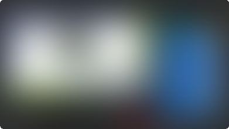
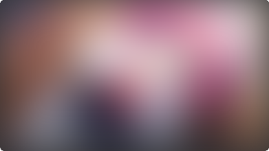

This entire section is dedicated to showcasing the user interface,
as well as how to use the fields and card options to change the card
to your liking.


# Definitions
**Binary Field:**
A field that checks whether it is filled or not with any value, say `1`.
The default is implied by the name of the field, and a value of "true" means that the field is filled.
For example, the `IsSentenceCard` field will turn the card into a sentence card if filled.
If it is not filled, then the card will be a word card.
To fill a field automatically, see
[here](faq.md#how-do-i-change-the-default-value-of-a-binary-field){:target="_blank"}.

<!--
To "toggle" a binary field means to either fill the value if is not filled yet,
or to remove the value if it is filled.
In other words, it means to flip the value of the field between empty and filled.
-->

**PA:** Short for "Pitch Accent".

---


# User Interface
Most of the user interface is already shown off in the [GUI demo](/jp-mining-note/#demos){:target="_blank"},
and I would recommend watching it before continuing.
However, to dispell any mysteries, here is a fully annotated summary of the user interface.


{{ img("UI annotated summary", "assets/eg_fushinnsha_diagram.png") }}


Additional information on some parts of the UI is stated below:

## Info Circle

=== "Default"
    <figure markdown>
      {{ img("info circle example", "assets/info_circle.gif") }}
      <figcaption>
        On hover, the info circle on the top left corner just shows some basic info.
        However, it also serves as a notification system to the user, when it has a color.
      </figcaption>
    </figure>

=== "Error"
    <figure markdown>
      {{ img("info circle error example", "assets/info_circle_error.gif") }}
      <figcaption>
        This should only appear when some javascript code fails.
        In other words, this should **not** appear under normal circumstances.
        If you get this without modifying the note in any way,
        please see [this section](faq.md#errors){:target="_blank"} for basic troubleshooting.
      </figcaption>
    </figure>

=== "Warning"
    <figure markdown>
      {{ img("info circle error example", "assets/info_circle_warning.gif") }}
      <figcaption>
        This serves to warn the user about something.
        It can appear without completely breaking the functionality of the card.
        In other words, you can choose to ignore it.
      </figcaption>
    </figure>

=== "Leech"
    <figure markdown>
      {{ img("info circle error example", "assets/info_circle_leech.gif") }}
      <figcaption>
        When the card is a leech, the circle is highlighted yellow (or blue in light mode)
        to indicate that it is a leech.
        This is only shown on the back side of the card.
      </figcaption>
    </figure>


### Locking the Info Circle

{{ feature_version("0.10.3.0") }}

You can toggle (click on) the info circle to lock the tooltip in place.
This may be useful for copying/pasting errors and other debugging purposes.


## Kanji Hover
<i><sup>Main page: [Kanji Hover](kanjihover.md)</sup></i>

Kanji hover shows you if you have seen the kanji in previous cards or not.
This is useful if you want to check whether you have seen the reading
in a previous card, to differentiate between similar kanjis, etc.

By default, it searches for the kanji within the "Word" field,
only for notes of the same type (JP Mining Note).

{{ img("kanji hover demo", "assets/kanji_hover.gif") }}

Notice how some results are greyed out.
Those results are results from cards that have not been reviewed yet.
Conversely, as non-greyed out results come from cards that you have already reviewed,
they should represent words that you already know.


!!! note
    The maximum number of results, as well as the exact queries themselves,
    can be changed in the [options file](runtimeoptions.md){:target="_blank"}.


## Word Pitch
The colors and what the lines mean are all described in the
official anki addon page as specified
[here](https://ankiweb.net/shared/info/1225470483).


## Images
Outside of the normal click to zoom image at the top right,
any customly inserted images, including images inserted directly by Yomichan,
will be converted to text which you have to hover over to reveal.
Of course, this image can also be clicked on to zoom.
See the video demo below to see exactly what happens.


---


# Modifying the Front Side (Tested Content)
The front side is exactly the content that we want to test ourselves on.
Naturally, since we can test ourselves on many aspects of the word, there are
many ways to change this tested content.


## Card types
<i><sup>Full list: [Card Types](cardtypes.md)</sup></i>

The default card type is a vocab card,
where the tested content is simply the word.

To change the card to a sentence card, fill the `IsSentenceCard` binary field.

=== "Vocab card"
    {{ img("vocab card example", "assets/nisemono_word.png") }}
=== "Sentence card"
    {{ img("sentence card example", "assets/nisemono_sentence.png") }}


## Changing the Displayed Content
Vocab cards show the `Word` field and sentence cards show the `Sentence` fields by default.
However, you can modify what is exactly shown in the front by using the `AltDisplay` field.

=== "Newline"
    <figure markdown>
      {{ img("altdisplay with newline", "assets/nisemono_altdisplay_newline.png") }}
      <figcaption>
        The previous sentence card looks a little ugly,
        because the sentence splits off at a strange point.
        To fix this, we add a newline at a sensible place (after the period) in the `AltDisplay` field.
      </figcaption>
    </figure>

=== "Last sentence only"
    <figure markdown>
      {{ img("altdisplay with only last sentence", "assets/nisemono_altdisplay_last_sent.png") }}
      <figcaption>
        Alternatively, we can simply test the last sentence, by removing the first sentence.
      </figcaption>
    </figure>


One nice feature is that the `AltDisplay` has hoverable furigana text enabled by default.
In other words, you can use furigana in the field.
I personally use this to insert furigana for certain names, since I'm usually not
testing myself on how to read a name.

For example, the card below has the following HTML:
```html
上条[かみじょう] 恭介[きょうすけ]君のことお<b>慕い</b>してましたの
```

{{ img("altdisplay with furigana", "assets/altdisplay_furigana.gif") }}


!!! note
    If you are using a vocab card, you can use `AltDisplay`
    to show something that differs from the `Word` field.

!!! note
    On Hybrid Card types, the `AltDisplay` field only affects the sentence, and not
    the front displayed word.


## Hints
Finally, you can include a customized hint to show at the front of the card, by using the `Hint` field.
This will show as a collapsible field at the front of card.

If you do not want the hint to be hidden by default, you can use the `HintNotHidden` field instead.

=== "Hint"
    {{ img("hint field demo", "assets/hint.gif") }}
=== "HintNotHidden"
    {{ img("HintNotHidden field demo", "assets/hint_not_hidden.png") }}

---


# Modifying the Back Side
Not much has to be said about modifying the back side of the card,
outside of modifying pitch accent.

* The `PrimaryDefinition` field contains the main content, and should be the main field to edit
    if one wants to put down more notes about the card.
    I personally use this to write down grammar point explanations, sentence pitch accent info, etc.
    on top of the defintions.

* The `AdditionalNotes` field is useful if you want to put down even more notes,
    but keep it in a collapsible field to reduce vertical space.
    I personally use it to write down the context of the scene,
    and other notes that aren't completely crutial to understanding the tested content.

* Bolding anything in these sections will highlight the word in a light yellow tint,
    to make the bold stand out more.

{{ img("", "assets/nisemono_modify_back_side.png") }}


## Modifying Pitch Accent
<i><sup>Main page: [Auto Pitch Accent](autopa.md)</sup></i>

The displayed pitch accent is usually the first position found in `PAPositions`.
However, you can override this automatically chosen position using the `PAOverride` field.


More information and customization, including automatically coloring the word
with Migaku colors, can be found in the main page linked above.


---


# Modifying Other Aspects of the Card

## `Key` field
This contains the tested word.
In other words, this contains the exact same content as the field below,
but this field is specifically not used in the card template.
This is to allow the user to modify the key if duplicates arise,
while still being able to test the word.

For example, if I were to test different usages of 上,
I can change this key value to `上 (preposition)`, `上 (grammar)`,
etc. and add a new card.

It is expected that this `Key` field is unique;
a warning will appear on cards that have a duplicate key.

## `Comment` field
Similarly to the `Key` field, this field will not be used in any card template.
In other words, this is a place where you can write down notes without affecting the card itself.

## `Picture` field
As an aside, you can put text in this field instead of a picture, and it should still work.
This is useful if you forgot to add the picture, or just don't want to add the picture
in the first place.

---


# Image Blur
{{ feature_version("0.10.3.0") }}

This allows you to blur the images of cards marked with a NSFW tag.

This behavior is **disabled by default**. In other words, you will not be able to blur
images unless the following setting is explicitly enabled
in the [runtime options file](runtimeoptions.md){:target="_blank"}:

```json
"img-utils": {
  "nsfw-toggle": {
    "enabled": "true",
    // ...
  }
}
```

<figure markdown>
  {{ img("example toggle blur gif", "assets/anki_blur/example.gif") }}
</figure>


To mark a card as NSFW, add any of the following tags to the card:

> `nsfw`・`NSFW`・`-NSFW`


!!! note
    Recall that you can use custom text in the `Picture` field instead of having an actual picture.
    This is useful if you simply don't want to save a particular image.


## Change Review Session State
The above demo shows how you can un-blur an image temporarily.
In other words, if you see that card again during the same review session,
the image will be blurred again.


The state of this can be changed for a review session.
To do this, hover over the info circle, and click on the eyeball to the top right to toggle between states.
This state will be maintained for the entire review session, but will be lost on the next session.

The tabs below show the available states.
By default, states cycle from left to right.


=== "Only Blur if NSFW"

    | Not Marked | Marked (with `NSFW` tag) |
    |:-:|:-:|
    | {{ img("", "assets/anki_blur/unmarked_revealed.png") }} |  |

=== "Always Blurred"

    | Not Marked | Marked (with `NSFW` tag) |
    |:-:|:-:|
    |  |  |

=== "Always Revealed"

    | Not Marked | Marked (with `NSFW` tag) |
    |:-:|:-:|
    | {{ img("", "assets/anki_blur/unmarked_revealed.png") }} | {{ img("", "assets/anki_blur/marked_revealed.png") }} |


??? example "Demos *(click here)*"

    === "Regular, unmarked card"
        {{ img("", "assets/anki_blur/example_session_toggle_unmarked.gif") }}

    === "Card marked as NSFW"
        {{ img("", "assets/anki_blur/example_session_toggle_marked.gif") }}

    !!! note
        Both examples have the info circle toggled (clicked), so the tooltip persists.


## Additional Details

- The eyeball to toggle the blur between an image will not be shown unless the card is marked as NSFW
    (or the review session state is "Always Blurred").
- Clicking on the blurred image will do nothing; you must click on the eye to un-blur the image.
    Forcing the user to click in a smaller area makes accidental reveals less common.
- After revealing the image, you can click on the image to zoom, as normal.
    You cannot click on a blurred image to zoom.
- Most things can be changed in the runtime options,
    including what tags can be used, the default initial state on PC/mobile, etc.
- This was heavily inspired by
    [Marv's implementation](https://github.com/MarvNC/JP-Resources#anki-card-blur)
    of the same feature.


# Testing Pitch Accent
This note type provides many options to target exactly what parts of pitch accent
you want to test yourself on.
By default, pitch accent is not tested.

To test for pitch accent, fill the `PAShowInfo` field.
You should see a circle to the left of the word or sentence.


## Pitch Accent Indicator
This circle you see is called the "Pitch Accent Indicator", or "PA Indicator" for short.
How this card indicates what pitch accent is tested is by the PA indicator's color.


{{ img("pitch accent indicators", "assets/pa_indicators.png") }}


Here are what the colors represent:

* **Green:** The *entire sentence* is tested.
* **Blue:** Only the *word* is tested.
* **Red:** Pitch accent should *not be tested* in any way.

If you ever forget what the colors mean, you can hover your mouse over the circle to
get a description of what is being tested.

Alternatively, you can look at the top right of the screen and look at the value after the `/`.

{{ img("pitch accent indicator hover demo", "assets/pa_indicator_hover.gif") }}


!!! note
    If the tested content is a sentence (card), but you want to only test for word pitch accent,
    you would not be able to see the word normally.
    To see the word that is tested, there is a button to toggle whether the word is highlighted or not.
    The content that is highlighted is exactly what is bolded in the `Sentence`
    (or `AltDisplay` / `AltDisplayPASentenceCard`) field, which is the added word by default.

    {{ img("show word button demo", "assets/show_word_button.gif") }}


## Selecting the Pitch Accent

The following shows how to fill in the proper fields to test pitch accent:


| Filled fields | PA Indicator | Separated Cards |
|-|-|-|
| (None, default) | (Doesn't exist) |     |
| `PAShowInfo` | Green (sentence) or blue (word), <br> depending on the tested content |     |
| `PAShowInfo` & <br> `PADoNotTest` | Red (not tested) |     |
| `PAShowInfo` & <br> `PATestOnlyWord` | Blue (word) |     |
| `PAShowInfo` & <br> `PASeparateWordCard` | Red (not tested) | Word |
| `PAShowInfo` & <br> `PASeparateSentenceCard` | Blue (word) | Sentence |
| `PAShowInfo` & <br> `PASeparateWordCard` & <br> `PASeparateSentenceCard` | Red (not tested) | Word & Sentence |

To clarify some of the above:

* By default, if only `PAShowInfo` is filled, then the entire display is tested
    * For vocab cards, targeted sentence cards, and hybrid vocab cards,
      only the word PA is tested (PA indicator: blue).
    * For sentence cards and hybrid sentence,
      the entire sentence PA is tested (PA indicator: green).
* To test just the word pitch accent, fill the `PATestOnlyWord` field.
* To create completely separate cards to just test pitch accent on,
  use the fields `PASeparateSentenceCard` and/or `PASeparateWordCard`.
* If a PA word card is created, then the default card does not test pitch accent.
  Similarly, if a PA sentence card is created, then the default card only tests the word pitch accent.


## Modifying Pitch Accent Sentence Cards
The field `AltDisplayPASentenceCard` exists to customize the display of the
PA sentence card, if it exists.
It works similarly to `AltDisplay`, and takes priority over `AltDisplay`
in the PA sentence card.

---


# Cloze Deletion Cards
In other words, "fill-in-the-blank cards". This allows you to create cards
that tests word audio or sentence audio.

To create a cloze deletion card, simply fill in the `SeparateClozeDeletionCard` field.
The words that are hidden are exactly the words that are bolded in the `Sentence` (or `AltDisplay`) field.

To create a sentence audio card, copy/paste the sentence into `AltDisplay`, and bold the entire `AltDisplay` field (say, with `ctrl+a` and `ctrl+b`).
There's currently no shortcut to creating a sentence audio card.

TODO: IsSentenceCard -> tests entire sentence, not filled -> currently as is

{{ img("cloze deletion card", "assets/cloze_deletion.png") }}

